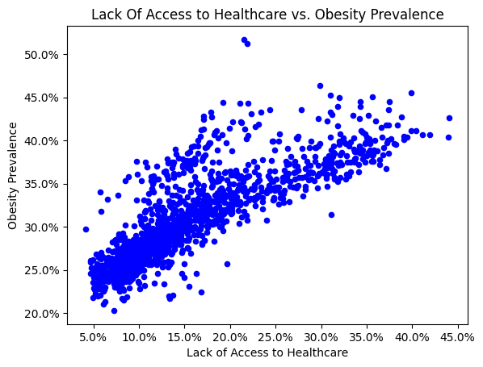
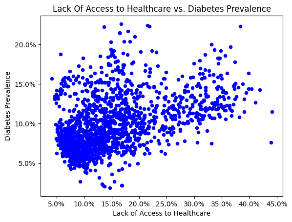
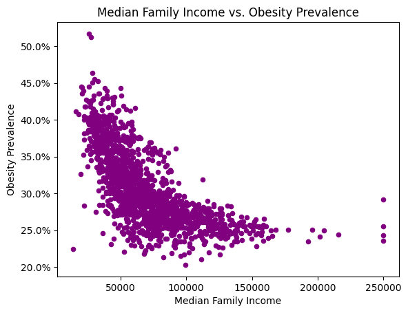
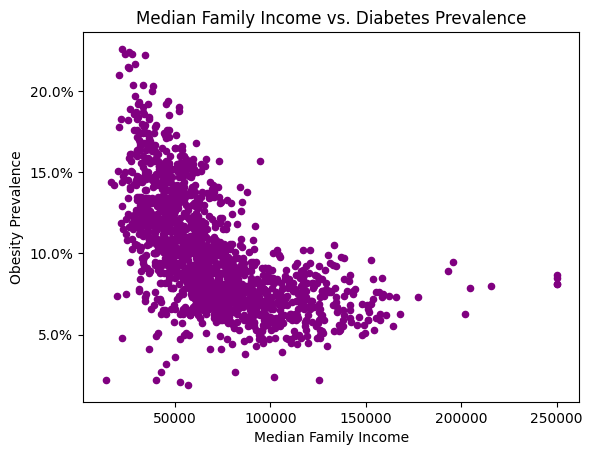
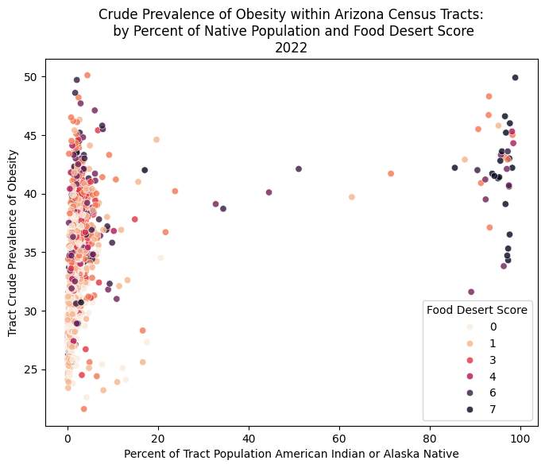
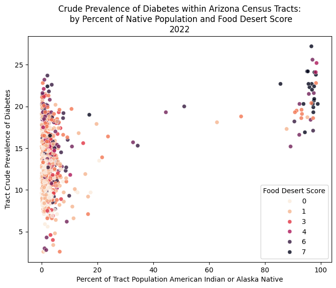

## Obesity and Diabetes Rates Over Time by Race (Mean + SE) -Hover to see values- 
```{python}
import numpy as np
import pandas as pd
import plotly.graph_objects as go
from matplotlib.ticker import FuncFormatter
import plotly.graph_objects as go

Unioned_Data_By_Race = pd.read_csv("data/Unioned_Data_By_Race.csv")

AGG_Columns_to_extract = ['year','%WhiteDiabetes','%WhiteObesity','%BlackDiabetes','%BlackObesity','%AsianDiabetes','%AsianObesity',
                     '%NHOPIDiabetes','%NHOPIObesity','%AIANDiabetes','%AIANObesity','%OMultirDiabetes','%OMultirObesity',
                     '%HispanicDiabetes','%HispanicObesity']
Unioned_Data_By_Race2 = Unioned_Data_By_Race[AGG_Columns_to_extract]
Unioned_Data_By_Race2
AGG_DATA = Unioned_Data_By_Race2.groupby('year').agg(['mean','std'])
def sem(x):
    return x.std()/np.sqrt(len(x))
AGG_DATA_SEM = Unioned_Data_By_Race2.groupby('year').agg(['mean',sem])
AGG_DATA_SEM = AGG_DATA_SEM.rename(columns = {'sem': 'std_error_mean'})
AGG_DATA_SEM

# Obesity
obesity_columns = {
    '%WhiteObesity': 'White',
    '%BlackObesity': 'Black',
    '%AsianObesity': 'Asian',
    '%NHOPIObesity': 'Native Hawaiian & Pacific Islander',
    '%AIANObesity': 'Native American & Alaskan',   
    '%OMultirObesity': 'Other/Multiracial',
    '%HispanicObesity': 'Hispanic'
}

HIGHLIGHT = 'Native American & Alaskan' # highlightng for emphasis 
color_map = {lab: ('#1f77b4' if lab == HIGHLIGHT else '#B3B3B3')
             for lab in obesity_columns.values()}

years = AGG_DATA_SEM.index.values

fig = go.Figure()

for col, race_label in obesity_columns.items():
    mean_vals = AGG_DATA_SEM[(col, 'mean')].values
    se_vals   = AGG_DATA_SEM[(col, 'std_error_mean')].values
    is_hi = (race_label == HIGHLIGHT)

    # one trace per race, with error bars & hover
    fig.add_trace(go.Scatter(
        x=years, y=mean_vals,
        mode='lines+markers',
        name=race_label,
        line=dict(color=color_map[race_label],
                  width=3 if is_hi else 1.5,
                  dash='solid' if is_hi else 'dash'),
        marker=dict(size=7 if is_hi else 6),
        error_y=dict(type='data', array=se_vals, thickness=1, width=0.0),
        customdata=np.column_stack([np.repeat(race_label, len(years)), se_vals]),
        hovertemplate=( # set up hover 
            "Race: %{customdata[0]}<br>"
            "Year: %{x}<br>"
            "Prevalence: %{y:.1%}<br>"
            "SE: %{customdata[1]:.1%}"
            "<extra></extra>"
        )
    ))

# layout / axes
fig.update_layout(
    title="Obesity Prevalence by Race Over Time (Mean ± SE)",
    xaxis_title="Year",
    yaxis_title="Obesity Prevalence",
    yaxis_tickformat=".0%",        # show as percent
    template="simple_white",
    hovermode="x",                 # hover follows vertical slice
    showlegend=False               
)

fig.show()

# Diabetes 
diabetes_columns = {
    '%WhiteDiabetes': 'White',
    '%BlackDiabetes': 'Black',
    '%AsianDiabetes': 'Asian',
    '%NHOPIDiabetes': 'Native Hawaiian & Pacific Islander',
    '%AIANDiabetes': 'Native American & Alaskan',   
    '%OMultirDiabetes': 'Other/Multiracial',
    '%HispanicDiabetes': 'Hispanic'
}

HIGHLIGHT = 'Native American & Alaskan'
color_map = {lab: ('#1f77b4' if lab == HIGHLIGHT else '#B3B3B3')
             for lab in diabetes_columns.values()}

years = AGG_DATA_SEM.index.values
fig = go.Figure()

for col, race_label in diabetes_columns.items():
    mean_vals = AGG_DATA_SEM[(col, 'mean')].values
    se_vals   = AGG_DATA_SEM[(col, 'std_error_mean')].values
    is_hi = (race_label == HIGHLIGHT)

    fig.add_trace(go.Scatter(
        x=years, y=mean_vals,
        mode='lines+markers',
        name=race_label,
        line=dict(color=color_map[race_label],
                  width=3 if is_hi else 1.5,
                  dash='solid' if is_hi else 'dash'),
        marker=dict(size=7 if is_hi else 6),
        error_y=dict(type='data', array=se_vals, thickness=1, width=0.0),
        customdata=np.column_stack([np.repeat(race_label, len(years)), se_vals]),
        hovertemplate=(
            "Race: %{customdata[0]}<br>"
            "Year: %{x}<br>"
            "Prevalence: %{y:.1%}<br>"
            "SE: %{customdata[1]:.1%}"
            "<extra></extra>"
        )
    ))

fig.update_layout(
    title="Diabetes Prevalence by Race Over Time (Mean ± SE)",
    xaxis_title="Year",
    yaxis_title="Diabetes Prevalence",
    yaxis_tickformat=".0%",      
    template="simple_white",
    hovermode="x",
    showlegend=False            
)

fig.show()
```

## Lack of Access to Healthcare vs. Obesity and Diabetes Rates By Tract
Obesity
<br>

<br>
Diabetes
<br>


## Median Family Income vs. Obesity and Diabetes Rates by Tract
Obesity
<br>

<br>
Diabetes
<br>


## 2022 Percent of Tract Population that is Native vs Obesity and Diabetes by Tract and Food Desert Score
Obesity
<br>

<br>
Diabetes
<br>
