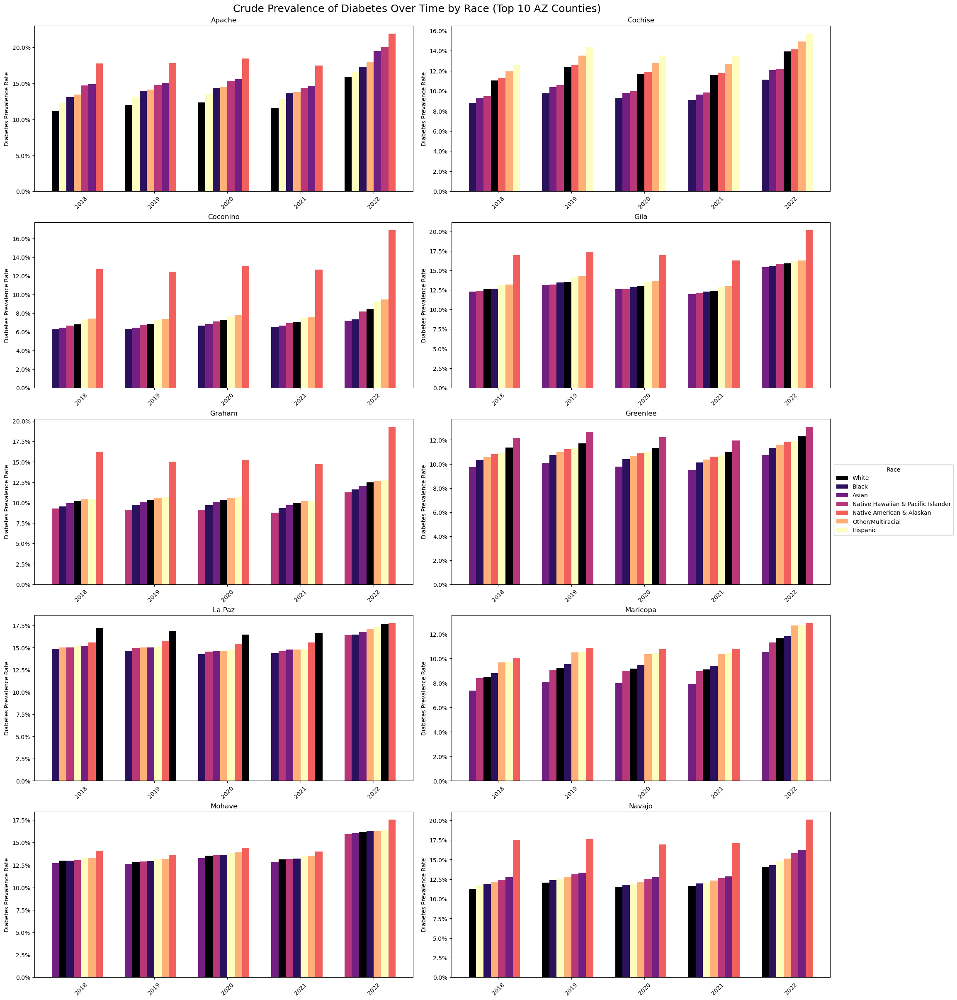
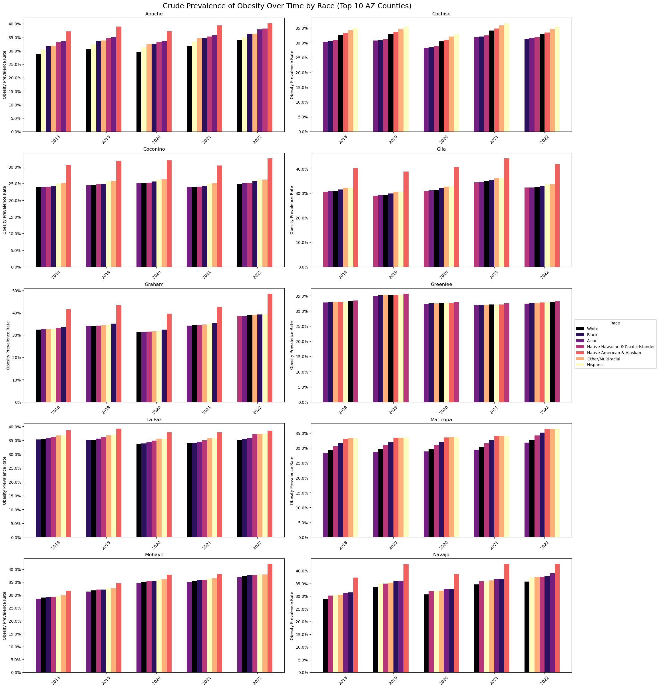
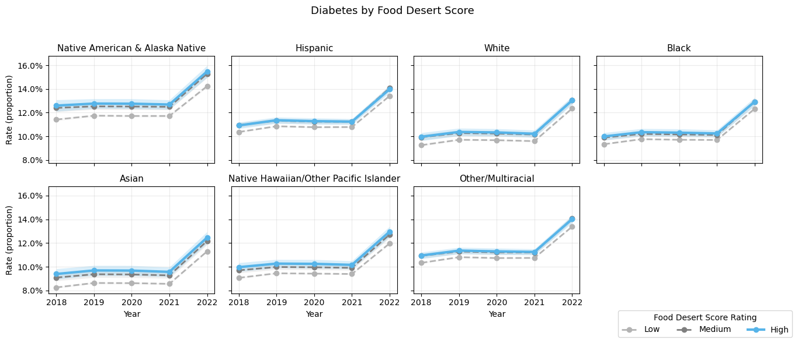
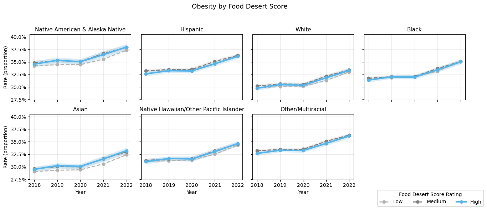

## Abstract

GeoHealthAI quantifies and maps the overlap of food access, poverty, and chronic disease in Arizona—with particular attention to Native Nations—using tract-level data from CDC PLACES, the USDA Food Access Research Atlas, and socioeconomic indicators. Using PySpark and Pandas, we integrate sources by tract FIPS and conduct descriptive analyses, correlation matrices, linear regressions, and z-score flagging to identify high-burden tracts. We deploy an interactive dashboard, including a heatmap and supplemental visuals to surface priority areas. Beyond data analysis, we aim to pair the analytics with interviews that center Native perspectives, providing culturally grounded context for community-informed public health action.

## Introduction

GeoHealthAI is a data science initiative aimed at identifying and visualizing food deserts and chronic disease risk zones across Arizona, with a focus on Native Nations. By combining tract-level public health data, USDA food access metrics, and spatial socioeconomic indicators, the project seeks to explore the relationship between food accessibility, poverty, and chronic health outcomes such as obesity and diabetes. We used PySpark for the data wrangling and processing, accompanied with Python’s Pandas to generate visualizations and perform analysis. Our goal is not only to explore statistical correlations, but to generate an interactive heatmap dashboard and identify high-risk areas for targeted public health interventions.

### Questions

#### Question 1: How does the intersection of food access, poverty, and geography contribute to the burden of chronic disease in Arizona?
#### Question 2: How does this vary between rural Native Nations and Urban areas?

### Data Journalism 

In addition to quantitative analysis, we are pursuing a data journalism approach to center Native voices and cultural context. We are conducting interviews with community members and cultural experts, including the owner of the Toadlena Trading Post and locals who reside on the Tohono O’odham Nation land, to understand barriers to healthcare access and traditional food systems. These narratives will help us interpret our findings through the lens of Indigenous experience — including questions about trust in Western medicine, infrastructure gaps, and tribal-led health solutions. The journalism piece will serve as a vital human-centered supplement to our statistical insights, bridging data and lived experience.

## Data Analysis & Methodology 

### Data 

We use two main datasets in this project:

- Dataset 1: CDC PLACES Census Tract Data (2020–2024 releases)- Provides modeled estimates of chronic disease prevalence at the census tract level. Datasets reflect Behavioral Risk Factor Surveillance System (BRFSS) data from two years prior. The 2020-2024 released datasets cover the years 2018-2020, respectively.
- Dataset 2: USDA Food Access Research Atlas (FARA)- Identifies tracts with low access to grocery stores, often used to define food deserts. Includes tract population counts and demographic data. Data reflects 2010 census tract information.

| Dataset | Key Variables | Purpose | Source |
|---|---|---|---|
| **CDC PLACES (Census Tract)** — releases 2020–2024 *(BRFSS ~2018–2022)* | OBESITY_CrudePrev, DIABETES_CrudePrev, CANCER_CrudePrev; TractFIPS, CountyName | Provide tract-level health outcomes for correlation/regression with food access & poverty; flag high-burden tracts (z-scores); enable multi-year trends. | <https://data.cdc.gov/500-Cities-Places/PLACES-Census-Tract-Data-GIS-Friendly-Format-2020-/ib3w-k9rq/about_data> |
| **USDA Food Access Research Atlas (FARA)** | LILATracts_1And10, LILATracts_halfAnd10, LILATracts_Vehicle, LATracts1/10/20; PovertyRate, LowIncomeTracts, MedianFamilyIncome; tract population by race; TractFIPS, CountyName | Operationalize food-desert severity and socioeconomic context; supply demographics for disparity analysis; provide join keys to align with PLACES. | <https://www.ers.usda.gov/data-products/food-access-research-atlas/download-the-data> |

These publicly available datasets collectively cover 1,516–1,520 census tracts across Arizona, including rural, metro, and tribal lands.These datasets reflect data from 2018-2022, effectively capturing pre-pandemic, pandemic, and post-pandemic health and disease prevalence within Arizona communities. This series of data allows for the added element of time as an analysis option when exploring the relationship between food accessibility and chronic health outcomes within these tracts. 

### Cleaning and Processing 

Given the spatial and demographic complexity of our data, we chose a combination of PySpark and Pandas for scalable processing and exploratory data analysis. We employ:

- Descriptive analysis (.describe, null checks, distribution plots)
- Correlation matrices (to assess relationships between variables)
- Regression modeling (linear models to predict disease rates based on food access and income)
- Z-score flagging (to identify outliers and high-burden tracts)

This multi-pronged approach allows us to identify both global trends (e.g., statewide patterns in obesity) and local outliers (e.g., specific tribal tracts with extreme health burdens).

We first brought the CDC PLACES and USDA FARA tables onto the same footing by joining on census-tract FIPS; four records didn’t match across sources and were dropped. Within each dataset we tidied and harmonized fields: for CDC PLACES (2020–2024 releases) we verified tract IDs, aligned variable names across years, and removed rows with missing values; for the USDA atlas we clarified flag names and built a composite Food Desert Score by summing the key access indicators. Using tract population by race, we also generated race-specific health counts to support disparity analyses. 

## Literature Review 

Research shows that food deserts are strongly linked to poor health outcomes such as obesity and diabetes, especially in rural and Native communities (Sallis et al., 2020). Navajo Nation and other tribal lands often face compounded barriers: vast distances to grocery stores, lack of transportation, and limited healthcare access (Hossain et al., 2021; Burnette et al., 2020). Prior studies have used survey data or point-based facility mapping, but recent work emphasizes the need for multi-scale geospatial modeling that combines satellite imagery with community-level health and infrastructure data.

For example, Hossain et al. (2021) used remote sensing to map food deserts in tribal lands but did not integrate health outcomes. Burnette et al. (2020) conducted qualitative studies highlighting social determinants in Native communities but lacked spatial predictions. Kelli et al. (2019) identified the impact that low area income within a food desert appears to have on cardiovascular health, but did not isolate Native localities. Sallis et al. (2020) called for advanced spatial methods to visualize disparities more precisely.

GeoHealthAI advances this work with an integrated, tract-level approach that fuses CDC PLACES health estimates with USDA food-access metrics to reveal where risks cluster. Our contribution is a clear, interactive heat-map that lets users explore patterns across race, poverty, and access—so tribal policymakers, public health planners, and researchers can quickly pinpoint priority areas for food and health interventions.

## Results 

Through our thorough exploratory data analysis, various regressions, and plotting of key variables’ relationships, we were able to successfully highlight the disparities present when it comes to food access and rates of chronic health diseases in Arizona. It is clear that those in rural areas have greater rates of diabetes and obesity, correlating with to their access to food and healthcare. The population affected the most is the Native American/Alaskan Native group, showing much higher rates consistently over time. We sought to answer two questions: 

- Question 1: How does the intersection of food access, poverty, and geography contribute to the burden of chronic disease in Arizona? We found that intersection of food access, poverty, and place is strongly associated with chronic disease burden. Tracts scoring higher on food-desert indicators (distance to stores, low income + low access, limited vehicle access) show substantially higher obesity and diabetes.
- Question 2: How does this vary between rural Native Nations and Urban areas? Our analysis concluded that the burden is higher and grows faster in rural Native Nations than in urban areas of Arizona. Even looking at the trends over time, Native American/Alaskan Native communities start higher and stay higher, and the Food Desert Score gradient is strongest for these panels as well.

Figure 1: Diabetes Prevalence Rates, Top-10 AZ counties by Race 
Across 2018–2022, diabetes prevalence rose in nearly every county and race, with Native American & Alaska Native (AIAN) consistently the highest. The gap is most visible in counties with large tribal land (e.g., Apache, Navajo). Other groups trend upward too, but from lower baselines.

Figure 2: Obesity Prevalence Rates, Top-10 AZ counties by Race
Obesity rises statewide across years, again with AIAN highest in most counties and visible growth in counties overlapping tribal lands. In more urban counties the levels are lower, though trends remain upward.

Figure 3: Diabetes Rates by Food Desert Score (FDS), by Race 
Within each race, the High FDS (blue) line sits above Medium/Low and often diverges by 2022, especially for AIAN, where the increase is steepest. This shows a clear trend: more severe food-desert conditions leads to higher diabetes prevalence.

Figure 4: Obesity by Food Desert Score (FDS), by Race 
The same gradient appears for obesity: High FDS > Medium > Low for every race, with the largest levels and increases for AIAN. By 2022, AIAN in high-FDS tracts reaches the highest obesity levels among all race–FDS combinations.

*FDS components used in our score (0-7): LowIncomeTracts, LILATracts_1And10, LILATracts_halfAnd10, LILATracts_1And20, LILATracts_Vehicle, LATracts1, LATracts10, LATracts20; Higher scores indicate farther distance to supermarkets, lower income + access, and limited vehicle access.* 

To quickly surface “hot spots,” we standardized each tract’s obesity & diabetes prevalence and Food Desert Score (FDS) using z-scores and flagged tracts > 2 SD above the statewide mean (a conservative threshold ≈ top 2–3%). The flags concentrate in high-FDS (score = 7) tracts and cluster geographically in counties with large tribal lands—Apache, Navajo, Coconino, and nearby rural counties (Gila, Graham, La Paz), with some pockets in Maricopa. The most common co-flag was High FDS + High Diabetes, consistent with our FDS gradient plots and regression results. High Obesity outliers also appear—e.g., a Graham tract at ~42.8%—but were less frequent than diabetes outliers at the >2 SD cut.  Overall, the z-score results corroborate our model findings: food-access disadvantage and poverty bundle with higher chronic-disease burden, especially in rural/tribal tracts, and provides a practical shortlist of tracts for targeted outreach and validation on the interactive map.

Finally, regression models showed that poverty, food access, and healthcare access are strong predictors of obesity and diabetes, which supports the focus of our risk modeling. We ran Type III tests with Race and Year as key variables:
- ANOVA (Year as categorical): For both obesity and diabetes, race is significant (p < 1e-12), and year is significant (p ≲ 1e-5 to 1e-21). The Race x Year interaction is not—so the ordering of groups is stable over time. Partial η² for Race is ~0.12–0.14 (moderate); for Year it’s ~0.06 (obesity) and ~0.19 (diabetes), implying stronger time growth on diabetes.
- ANCOVA (Year as continuous, centered): We found a similar trend here, race and year are both significant; Race x Year is tiny and non-significant. Effect sizes are similar (Race η²ₚ ≈ 0.12, Year η²ₚ ≈ 0.05–0.09).

After adjusting for time, race differences remain, with the Native American/Alaskan Native (AIAN) population being the highest; and prevalence is increasing over time, more clearly for diabetes. Using AIAN as the baseline, coefficients for other races are negative at every quantile for both outcomes. The gaps are smallest at the 25th percentile and largest at the 75th (e.g., for obesity at q=0.75, other groups are ~2–5 percentage points lower than AIAN). That tells us disparities aren’t only at the mean, but that they widen in higher-burden tracts.

## Discussion 

Both FDS figures 3 and 4 show a monotonic gradient within each race, and the steepest/highest lines for that of the Native American/Alaskan Native population. That pattern is consistent with our regressions that flagged poverty, access, and healthcare access as strong correlates of chronic disease.

Taken together, our results show that Native American & Alaska Native communities carry the highest burden, and these gaps persist even after accounting for time. The factors that matter most are food access constraints, such as distance to full-service groceries, limited vehicle access, and poverty, all captured in our Food Desert Score (FDS). On the map, these pressures concentrate in rural/tribal tracts, where high-FDS areas consistently align with higher obesity and diabetes rates. Combining all of our insights gained through our data analyis and visualizations with the heat map gives a clear playbook for action: prioritize mobile clinics, co-ops and mobile markets, transportation support, and tribal-led prevention in the highest-need places.

Our heat map highlights clusters along major tribal lands (e.g., Apache and Navajo counties) where high rates of chronic-disease prevalence exist. The heatmap is interactive, offering the ability to compare disease rates across races and county per year. Interviews echo the data: long travel times, few full-service groceries, limited transport, and mixed trust in outside health systems. Community members also emphasized the role of traditional foods and interest in tribal-led health solutions—which aligns with targeting interventions locally rather than importing generic fixes.

## Limitations & Future Work 

One key limitation of our analysis lies in the accuracy and completeness of demographic data—particularly for tribal lands. The available data on tracts containing Native American tribal nations likely underrepresents the true population and health dynamics of these communities due to historical undercounting, outdated boundaries, or incomplete reporting. This makes it difficult to draw fully representative conclusions about health disparities in these areas. 

Additionally, our population data for Arizona tracts is sourced from 2021 food access research atlas data that uses the 2010 Census, which is now significantly outdated. Given the rapid growth and shifting demographics in many parts of the state, especially urban and suburban regions, this outdated baseline introduces uncertainty into our calculated prevalence rates and comparisons across counties and racial groups.

Data for calculated prevalence across racial groups was used based on simulated data using the quantity of people of a given race in a tract, multiplied by the overall prevalence rate within that specific tract. If different racial groups have different prevalence rates within a tract, the actual data might be slightly different than our simulated data.

For future work, access to more current population estimates—such as from the 2020 Census or intercensal updates—would enhance the reliability of our analyses. With updated population data, we could refine prevalence rate calculations, improve normalization across counties and racial categories, and make stronger, more actionable conclusions. Moreover, incorporating additional data sources specific to tribal nations or partnering with tribal epidemiology centers could provide a more accurate and nuanced view of Native health outcomes and the structural factors driving disparities.

## References 

- Burnette, C. E., et al. (2020). "Indigenous women’s perspectives on health: Implications for health equity." Social Science & Medicine, 258, 113095.
- Centers. (2021, September 29). PLACES: Census Tract Data (GIS Friendly Format), 2020 release. Cdc.gov. <https://data.cdc.gov/500-Cities-Places/PLACES-Census-Tract-Data-GIS-Friendly-Format-2020-/ib3w-k9rq/about_data>
- Centers. (2022, October 4). PLACES: Census Tract Data (GIS Friendly Format), 2021 release. Cdc.gov. <https://data.cdc.gov/500-Cities-Places/PLACES-Census-Tract-Data-GIS-Friendly-Format-2021-/mb5y-ytti/about_data>
- Centers. (2023, June 15). PLACES: Census Tract Data (GIS Friendly Format), 2022 release. Cdc.gov. <https://data.cdc.gov/500-Cities-Places/PLACES-Census-Tract-Data-GIS-Friendly-Format-2022-/shc3-fzig/about_data>
- Centers. (2024, July 10). PLACES: Census Tract Data (GIS Friendly Format), 2023 release. Cdc.gov. <https://data.cdc.gov/500-Cities-Places/PLACES-Census-Tract-Data-GIS-Friendly-Format-2023-/hky2-3tpn/about_data>
- Centers. (2020, October 19). PLACES: Census Tract Data (GIS Friendly Format), 2024 release. Cdc.gov. <https://data.cdc.gov/500-Cities-Places/PLACES-Census-Tract-Data-GIS-Friendly-Format-2024-/yjkw-uj5s/about_data>
- Food Access Research Atlas - Download the Data | Economic Research Service. (2021, April 27). Usda.gov. <https://www.ers.usda.gov/data-products/food-access-research-atlas/download-the-data>
- Hossain, M. S., et al. (2021). "Food environment and access in American Indian reservations: A remote sensing approach." International Journal of Environmental Research and Public Health, 18(2), 489.
- Kelli, H. M., Kim, J. H., Samman Tahhan, A., Liu, C., Ko, Y., Hammadah, M., Sullivan, S., Sandesara, P., Alkhoder, A. A., Choudhary, F. K., Gafeer, M. M., Patel, K., Qadir, S., Lewis, T. T., Vaccarino, V., Sperling, L. S., & Quyyumi, A. A. (2019). Living in Food Deserts and Adverse Cardiovascular Outcomes in Patients With Cardiovascular Disease. Journal of the American Heart Association, 8(4). <https://doi.org/10.1161/jaha.118.010694>
- Sallis, J. F., et al. (2020). "Healthy Communities for Healthy Lives: Health and Place." Annual Review of Public Health, 41: 167–183.